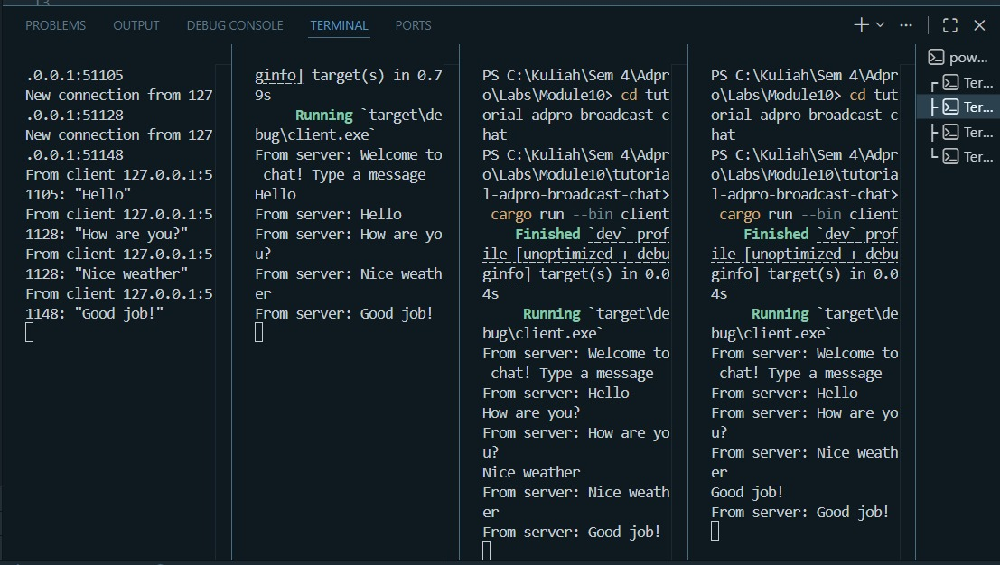
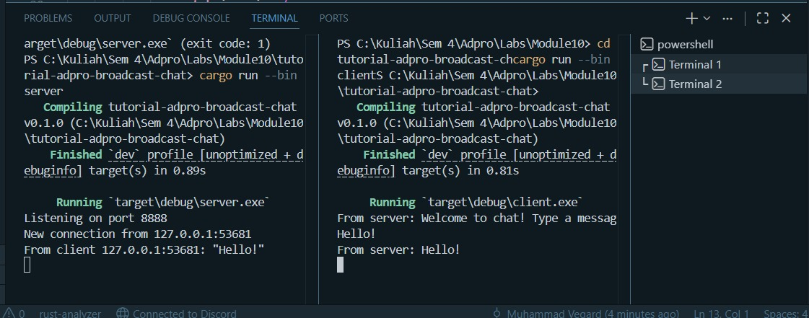

## Experiment 2.1: Original code, and how it run

Run the server first with `cargo run --bin server`, then run multiple clients
with `cargo run --bin client` in separate terminals.
When a client types a message, the server receives it and broadcasts it to
all connected clients. This works asynchronously — the server handles all
clients concurrently without blocking.

## Experiment 2.2: Modifying port

The port was changed from 2000 to 8080 in both server.rs and client.rs.
Both files need to be modified because WebSocket is a connection-based protocol —
both sides (server and client) must agree on the same port, like two people
agreeing on which phone number to call.
The `ws://` prefix in the client indicates it is using the WebSocket protocol.